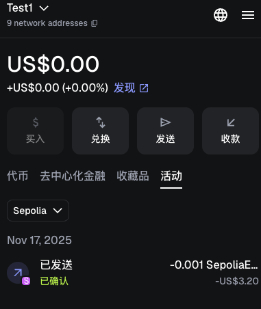
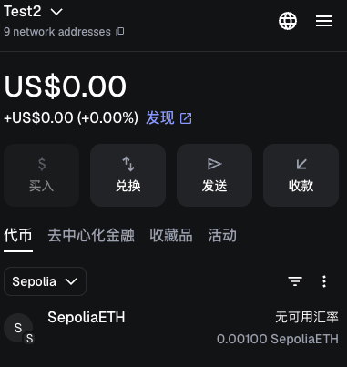
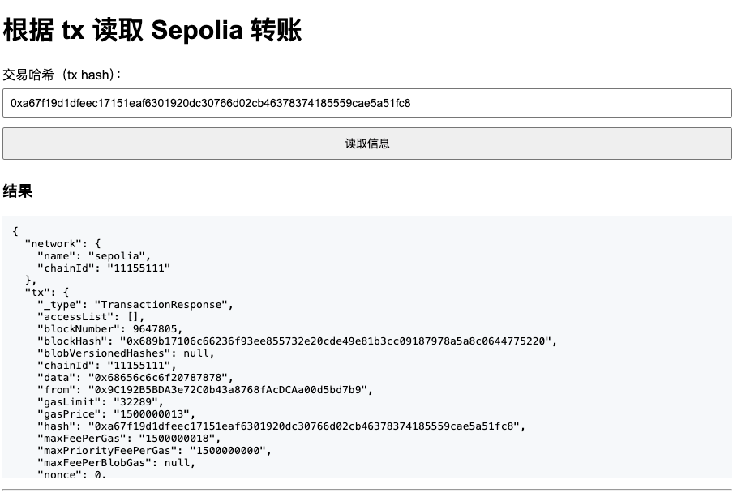
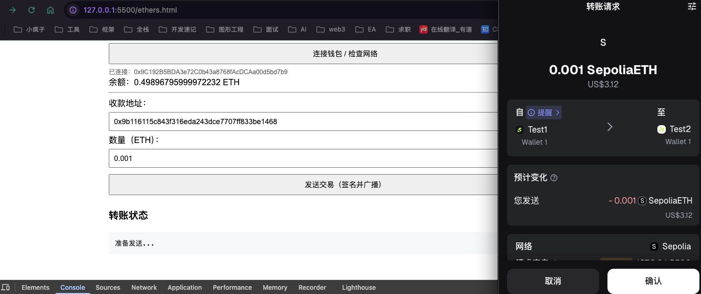
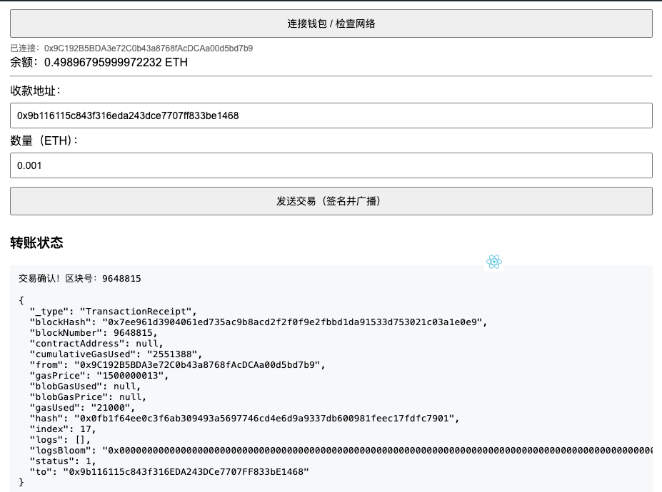
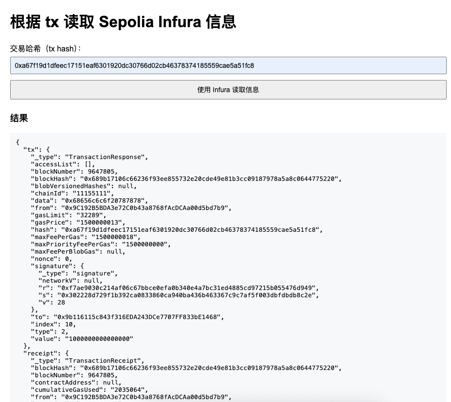

1.寻找 Sepolia 水龙头(发给你测试币的网址)，
● 水龙头：https://cloud.google.com/application/web3/faucet/ethereum/sepolia

2.使用 MetaMask 转账到 Zero Address 花费 gas（我转给自己的账户）
zero address: https://etherscan.io/address/0x0000000000000000000000000000000000000000

3.在测试网 https://sepolia.etherscan.io/ 4.对 16 进制的数据有一个自己的加密和解密方式
● 

—-⭐️ 如果想简单点小狐狸 前端页面 ⭐️⭐️—- 5.通过 Ether.js 完成链上数据的读取
● matemask 最好只用于：连接账户、获取 signer、sendTransaction()、switch chain，不要用它来读取区块链数据
○ 测试网会访问受限：MetaMask 内置的 RPC（免费通道）在高峰期或频繁请求时会被限流

○ 使用其他方式：
■ const provider = new ethers.EtherscanProvider("sepolia", "API_KEY");
■ const provider = new ethers.JsonRpcProvider("https://1rpc.io/sepolia");【推荐】
○ 

6.了解 The Graph 完成链上数据读取的 Demo
● 文件在 gran.html 7.种方式数据上链：

● 做一个完整的界面，数据上链分为 2 种方式
● 直接转账方式下面 👇 这 2 种
● 1.使用 Ether.js 读取链上数据

● 1-1.使用 https://www.infura.io/zh、Aalchemy读取链上的数据

